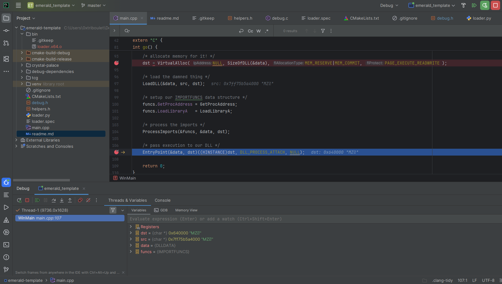
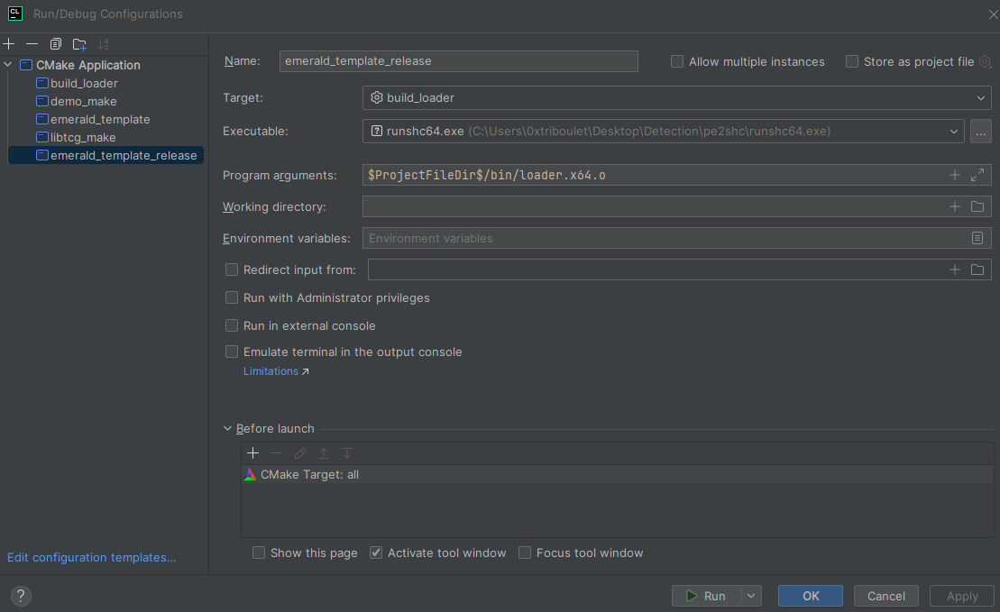

# emerald-template

**emerald-template** is a CMake-based project template designed for developing and debugging Reflective DLL Loaders using the **Crystal Palace** linker.

This template wraps the functionality of the "Simple Loader 1" example provided by the Tradecraft Garden. It transforms the standard makefile-based workflow into a **CLion-compatible** project. This allows for source-code level debugging of your loader logic from **Windows** (and theoretically Linux) systems before compiling the final position-independent shellcode.

This project follows the design patterns established by [BOF-VS](https://github.com/Cobalt-Strike/bof-vs). While the loader is fundamentally C code, this template compiles it using a C++ compiler with `extern "C"` blocks. This enables the use of **DFR (Dynamic Function Resolution)** macros and other modern conveniences while maintaining the structure required for reflective loading.



## Prerequisites

To use this template effectively, you require the following tools:

*   **CLion**: [Download Here](https://www.jetbrains.com/clion/download/?section=windows). This is the primary IDE for this template.
*   **WSL (Windows Subsystem for Linux)**: [Video Guide](https://tradecraftgarden.org/videos.html). You must have a WSL distribution installed (e.g., Ubuntu).
    *   Ensure `make` and `mingw-w64` are installed inside your WSL instance (`sudo apt install make mingw-w64`).
*   **MinGW Binaries for Windows**: [Download Here](https://github.com/niXman/mingw-builds-binaries/releases). These binaries must be installed on your Windows host and added to your System PATH to allow CLion to compile the debug executable locally.
*   **Python 3**: Required for the helper script that converts your target DLL into a C header for debugging.

## Setup

#### **Important:** Crystal Palace is not released on public git platforms. Consequently, it cannot be included as a submodule in this repository. You must download the necessary files and arrange them manually.

1.  Clone this repository:

    ```bash
    git clone <your_fork_or_clone_url>.git
    cd emerald-template
    ```

2.  Initialize and update any git submodules used by the template:

    ```bash
    git submodule update --init --recursive
    ```

3.  Download **Crystal Palace**:  
    <https://tradecraftgarden.org/crystalpalace.html>

4.  Download **Tradecraft Garden** source (for libtcg and examples):  
    <https://tradecraftgarden.org/tradecraft.html>

### Folder Structure

Organize your project folder to match the following structure exactly. You will need to copy the `crystal-palace` binary folder and the `tcg` source folder into the project root.
```
plain text
emerald-template>tree
Folder PATH listing for volume Windows
Volume serial number is 5048-32BA
C:.
├───.idea
├───bin
├───crystal-palace
│   └───demo
│       └───src
├───deps
├───debug-dependencies
│   └───bin
├───tcg
│  └───libtcg
│      ├───bin
│      └───src
...snip...
└───CMakeLists.txt
```
## Usage

This template is designed to handle two distinct workflows: **Debugging** (creating an EXE) and **Building** (creating the reflective loader object).

### Configuration

The target DLL and build specification are controlled in `CMakeLists.txt`.
```
cmake
set(LOADER_SPEC "loader.spec")
set(DLL_PATH "crystal-palace/demo/test.${ARCH_EXT}.dll")
```
By default, the template uses the `test.*.dll` found in Crystal Palace's demo folder.

### 1. Debugging (Debug Build)

When you select the **Debug** profile in CLion:

1.  CMake checks for `debug.h`.
2.  If missing, it executes `loader.py`. This script reads the DLL specified in `DLL_PATH` and converts it into a C byte array inside `debug.h`. This step can also be performed manually using `loader.py`.
3.  The project is compiled as a standard Windows Executable (`.exe`).
4.  The entry point is hijacked to `WinMain`, allowing you to step through `go()` and other loader functions using the CLion debugger.
5.  External function resolution (e.g., `VirtualAlloc`) is macro-switched to use local imports instead of the hashed resolution used in the final shellcode.

**Changing the Target DLL:**  
If you change the `DLL_PATH` in CMake or modify the target DLL, you must manually delete `debug.h` or re-run `loader.py` to ensure the bytes in the header match your new DLL. You must also update `loader.spec` to use your new DLL path.
```shell
python loader.py path/to/your/new.dll
```
### 2. Building (Release Build)

When you select the **Release** profile in CLion:

1.  The code is compiled into an object file (`loader.x64.o` or `loader.x86.o`).
2.  Optimization flags (`-O0`) are applied (or disabled) based on your configuration.
3.  CMake invokes **WSL**.
4.  Inside WSL, it runs the **Crystal Palace Linker** (`crystal-palace/link`) using the `loader.spec` file.
5.  The final position-independent loader object is output to the `bin/` directory.

### 3. Adding Your Code

For now, additional `.cpp` files should **NOT** be added to `CMakeLists.txt`. Instead, they should be added as stand-alone `.cpp` files and included in `main.cpp` using:
```cpp
#include "your_file.cpp"
```
## Use DFR or not?

This template supports **Dynamic Function Resolution (DFR)** API decleration and usage, but also supports injection DFR definitions from the `loader.spec` file thanks to [this sick project](https://github.com/Henkru/cp-dfr-defs).

This template compiles the loader as C++ and wraps the loader entry points in `extern "C"` so that:

* You can use DFR helper macros and headers cleanly.
* The final object remains compatible with reflective loading.
* Alternatively, you can use the `loader.spec` file to inject DFR definitions.

### Debug vs. Release with respect to DFR

* **Debug builds**:
  * Prefer debuggability over exact parity with the final shellcode.
  * `loader.spec` is *NOT* used to resolve functions or to interact with the debuggable `.exe`.
  * API calls are typically mapped to local imports so you can set breakpoints and inspect parameters easily.
  * Under the hood, this may temporarily bypass the DFR path while keeping the same call sites in your code.

* **Release builds**:
  * Either use DFR in the source or specify the appropriate `deps/dfr_windows.spec` to run in `loader.spec`.
  * The final object is fully position‑independent and uses resolution according to your `.spec` configuration.

## CLion Release Run Configuration (Running the Shellcode Build)

By default, CLion is well‑suited for running the **Debug** executable, but Release builds in this template produce an **object file** (PIC shellcode), not an EXE. To run/test the Release output directly from CLion, you can add a dedicated Run/Debug configuration that uses an external **shellcode runner**.



One option is `runshc64.exe` from the [pe_to_shellcode](https://github.com/hasherezade/pe_to_shellcode/releases/tag/v1.2) project.

You can use any equivalent runner that accepts a `.o`/shellcode blob and executes it.

### Steps

1. **Create a new Run/Debug configuration**
   * Open **Run | Edit Configurations…**
   * Click **+** and choose **Custom Build Application** (or a similar template you prefer for invoking an external tool).

2. **Set the “Before Launch” task to build Release**
   * In the configuration, locate **Before launch**.
   * Remove any existing task that does not apply.
   * Add a **CMake Application** (or CMake build) step and configure it to:
     * Build the **Release** profile.
     * Use **CMake all** (build all targets) so the Release `.o` file is produced.

3. **Configure the shellcode runner**
   * Set the **Executable** (or **Program**) field to point to your shellcode runner, for example:

     ```text
     C:\path\to\runshc64.exe
     ```

   * Add arguments so it points to the Release object file created by this template, for example:

     ```text
     C:\path\to\project\bin\loader.x64.o
     ```

     (Adjust the path/name if you are using x86 or a different output pattern.)

4. **Apply and run**
   * Save the configuration.
   * Select it in the Run configuration dropdown.
   * Run (or Debug) the configuration. CLion will:
     * Build the Release target via **CMake All**.
     * Invoke `runshc64.exe` (or your chosen runner) against the freshly built `.o` file.


## Customizing loader.spec

The `loader.spec` file controls how Crystal Palace links your object files. Ensure the paths in this file match your project structure.

If you wish to pass the DLL path dynamically during the Release build, ensure your `loader.spec` uses relative paths to your DLL. Using a different DLL requires updating the paths in `loader.spec`. This is a limitation of passing environment variables to WSL that has not been fully worked around yet.

## License

MIT or Apache 2.0. Enjoy.

## Credits

*   **Raphael Mudge**: For Crystal Palace and the Tradecraft Garden examples.
*   **Cobalt Strike / Fortra**: For the BOF-VS and UDRL-VS pattern that inspired this template's structure.
*   **Henri Nurmi**: For the `cp-dfr-defs` project that facilitates DFR definition injection.